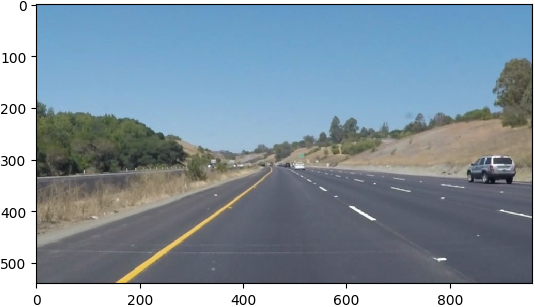
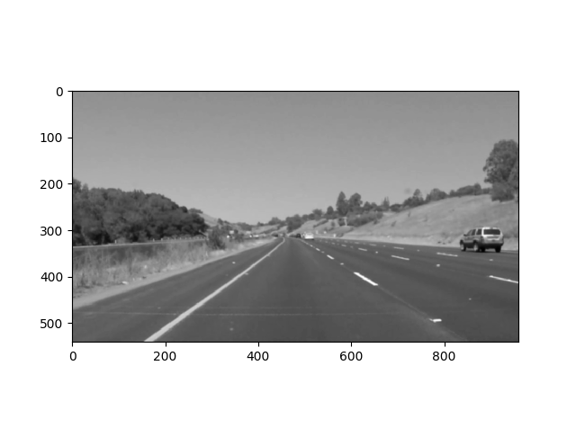
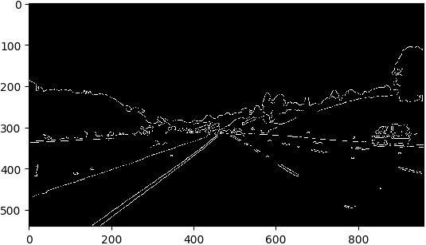
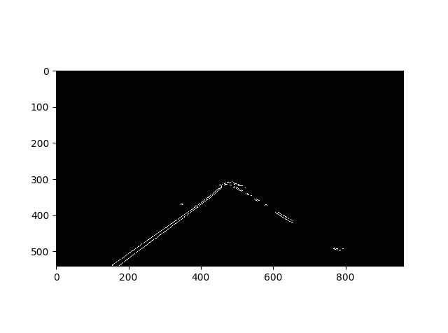
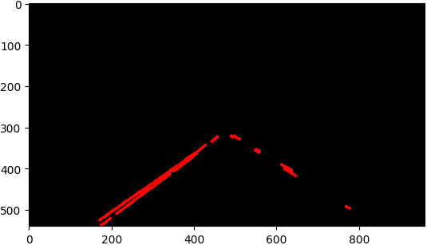
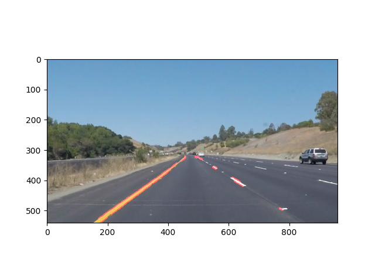
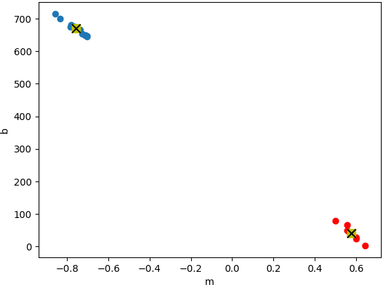
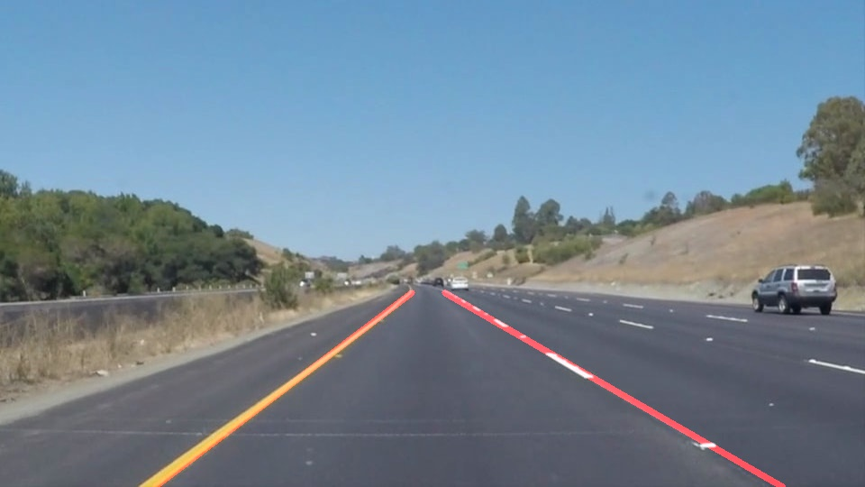

# **Finding Lane Lines on the Road** 

## Writeup

### You can use this file as a template for your writeup if you want to submit it as a markdown file. But feel free to use some other method and submit a pdf if you prefer.

---

**Finding Lane Lines on the Road**

The goals / steps of this project are the following:
* Make a pipeline that finds lane lines on the road
* Reflect on your work in a written report

---

### Reflection

### 1. Describe your pipeline. As part of the description, explain how you modified the draw_lines() function.

My pipeline consisted of 5 steps. The pipeline is shown below with output for each step:

* First, I converted the images to grayscale, 

* then I applied Gaussian Blur to reduce noise in the image so that Canny edge detection can pick up actual edges

* This was followed by Canny edge detection which detects the edges in the scene

* A mask was designed keeping in mind the perspective view of the lane, this helps to focus on region of interest when perform line detection using Hough transform

 

* A weighted sum between the original image and image with lines is done to draw the lines on the image.

* The objective of the project was to mark the lane marker with a continuous line. It is seen in the image below that the the slope and intercept of each line (calculated using [x1, y1] and [x2, y2]). It is easily seen that point cloud can be seperated in two classes.

I employed k-mean clustering to cluster the point clound (circular dots) in two regions and calculated the mean (square with a cross) slope and intercept for two regions. This provide me with an average slope for left and right lane marker.

* While processing the challenge video it was noticed that lot of horizontal lines were detected, even after trying to tune different paprameters in the pipeline descried above. Hence, I defined an ignore zone in the slope-intercept plot for lane line detection, as lane markers can never be horizontal. I ignored the slopes between -0.1 to +0.1.

* Another feature was introduced to smooth out the jumpy behavior of the extrapolated lines. This was accomplished by implementing a Kalman filter function which smooths out the jumpy behavior through online filtering of mean slope and intercept described in the previous step.

| Raw Lane Marker Lines  | Kalman Filtered Lane Marker Lines |
| ------------- | ------------- |
|<iframe width="560" height="315" src="https://www.youtube.com/embed/zlkc1QezSnk" frameborder="0" allow="autoplay; encrypted-media" allowfullscreen></iframe> | <iframe width="560" height="315" src="https://www.youtube.com/embed/aS_0JBul5hU" frameborder="0" allow="autoplay; encrypted-media" allowfullscreen></iframe>

<object width="425" height="350">
  <param name="movie" value="https://youtu.be/zlkc1QezSnk" />
  <param name="wmode" value="transparent" />
  <embed src="http://www.youtube.com/user/wwwLoveWatercom?v=BTRN1YETpyg"
         type="application/x-shockwave-flash"
         wmode="transparent" width="425" height="350" />
</object>

### 2. Identify potential shortcomings with your current pipeline

One potential shortcoming would be what would happen when ... 

Another shortcoming could be ...

### 3. Suggest possible improvements to your pipeline

A possible improvement would be to ...

Another potential improvement could be to ...
