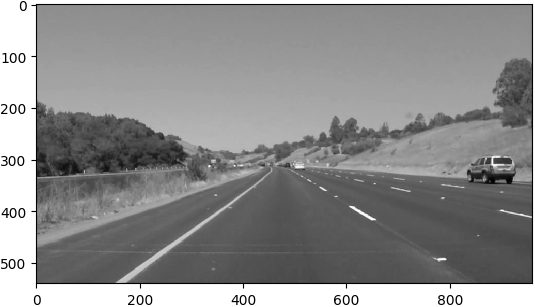
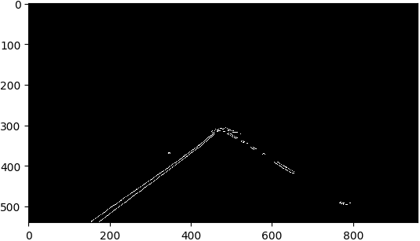
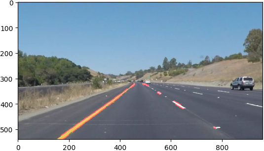

# **Finding Lane Lines on the Road** 

---

** The goals/steps of this project are the following: **
* Make a pipeline that finds lane lines on the road
* Reflect on your work in a written report

---

### Reflection

### 1. Description of pipeline

My pipeline consisted of 5 steps. The pipeline is shown below with output for each step:

* First, I converted the images to grayscale, 

* then I applied Gaussian Blur to reduce noise in the image so that Canny edge detection can pick up actual edges

* This was followed by Canny edge detection which detects the edges in the scene

* A mask was designed keeping in mind the perspective view of the lane, this helps to focus on region of interest when perform line detection using Hough transform

 

* A weighted sum of the original image and image with lines is done to draw the lines on the image.

### 2. Description of improvements to draw_lines() function
* The objective of the project was to mark the lane marker with a continuous line. It is seen in the image below that the slope and intercept of each line (calculated using [x1, y1] and [x2, y2]). It is easily seen that point cloud can be separated into two classes.

I employed k-mean clustering to cluster the point cloud (circular dots) in two regions and calculated the mean (square with a cross) slope and intercept for two regions. This provides me with an average slope of left and a right lane marker.

* While processing the challenge video it was noticed that lot of horizontal lines were detected, even after trying to tune different parameters in the pipeline described above. Hence, I defined an ignore zone in the slope-intercept plot for lane line detection, as lane markers can never be horizontal. I ignored the slopes between -0.1 to +0.1.

* Another feature was introduced to smooth out the jumpy behavior of the extrapolated lines. This was accomplished by implementing a Kalman filter function which smooths out the jumpy behavior through online filtering of mean slope and intercepts described in the previous step.

| Raw Lane Marker Lines  | Kalman Filtered Lane Marker Lines |
| ------------- | ------------- |
| | |
|||
||

### 2. Identify potential shortcomings with your current pipeline

There are few shortcomings I see here.

* I sure that the pipeline will behave poorly if there is a car in the region of interest as the algorithm does not know how to distinguish between objects on road.

* Another challenge could be the lighting of the scene changes (eg. shadows, dawn, dusk or night)

* If there are other kinds of markers on the road it may create a problem for this pipeline.

### 3. Suggest possible improvements to your pipeline

* It will be a significant improvement if the code knows what it is looking for rather than isolating features and then assuming that the detected lines are lanes.

* Also the lane marker should be a higher order polynomial rather than a straight line. This will help the code see upcoming turns.

* The code should also be able to filter out different objects (other cars, humans etc.) in the region of interest.
